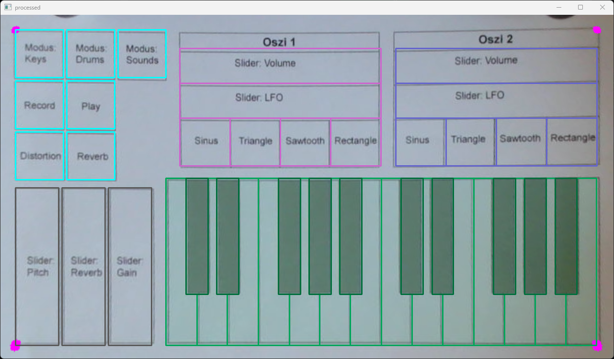

# Paper Synthi
## Description
This Project called "Paper Synthi" is a simple synthesizer that can be played on a piece of paper. It uses a webcam to detect the position of a colored objects and your index finger. The positions are then mapped to midi notes and sent to a midi port. The midi port can be used by any synthesizer to play the notes. But this project also includes a WebAudioAPI synthesizer that can be played in your browser. You will see the same layout and settings as on the paper. So you can play the synthesizer on the paper and in the browser at the same time.

### Features
#### Object Detection
- openCV and mediapipe to detect the position of the colored objects and your index finger
- midi output to loopMIDI
- save and load the corner points of the paper layout

#### WebAudioAPI
- HTML page to visualize the same layout as on the paper
- WebAudioAPI receives midi notes from the midi port and plays the notes

## Requirements
- a webcam
- tested with Python 3.8.10
- loopMIDI to loopback midi to WebAudioAPI
    - download [loopMIDI](https://www.tobias-erichsen.de/software/loopmidi.html)

## Install
- create a virtual environment
  - ```python3 -m venv env```
- activate the virtual environment
    - ```source env/bin/activate``` (Linux)
    - ```env\Scripts\activate``` (Windows)
- install the requirements
    - ```pip install -r requirements.txt```


## Usage
- start loopMIDI and create a virtual midi port


- select video source
    - ```cap = cv2.VideoCapture(0)``` (webcam index)
    - ```cap = cv2.VideoCapture('video.mp4')``` (video file)
- start the server
    - ```python3 opencvSynthi.py```
- print out the paperSynthi_layout.pdf and place it on a flat surface with enough light
- start the program

### setup input window
- frame the webcam on the paper, with enough space for the hands to be detected

- in input window select the corner points of the paperSynthi_layout.pdf
    - double check in output window if the points layouts are matching


### setup colors
- pick some colored objects and place them on the paper
- use a color picker to get the HSV values of the objects
- edit the HSV values in the color settings, and select the color you want to use to detect the objects

````python
# --- Color Settings
hsvTreshold = 60
hsv_orange = [14, 38, 59]
hsv_red = [349, 62, 39]
hsv_green = [160, 84, 12]
hsv_blue = [204, 56, 35]

hsv_objectColor = hsv_blue   # select color
````


### WebAudioAPI
- open the WebAudioAPI synthesizer in your browser (tested with Chrome)
    - ```/webAudioAPI/index.html```
    - you can use live server (VS Code extension) to serve the files
- allow the browser to use the midi port

### play
- move the colored objects on the paper to change the synthesizer settings, like pitch, LFO, reverb, etc.
- use your index finger to play the notes on the keyboard
- exit the program by pressing 'esc'


## Work in Progress
Not all planned features are implemented yet, as this was a project for a university course. 
I have no plans to continue this project, but feel free to fork it and continue the development.

- Sound modes are not implemented yet
    - (Keys, Drums, Sounds)
- Recording is not implemented yet
    - (Record, Play)
- The Sound of the WebAudioAPI synthesizer could be improved

